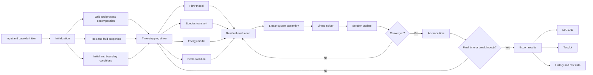
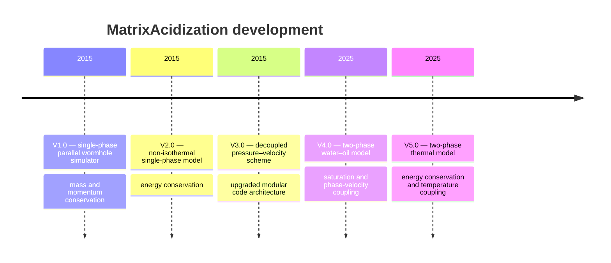
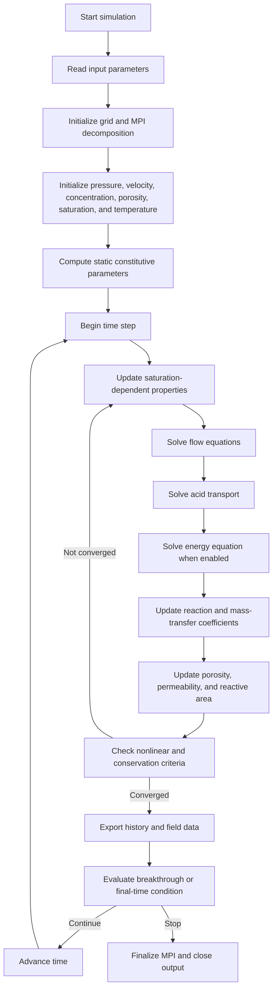
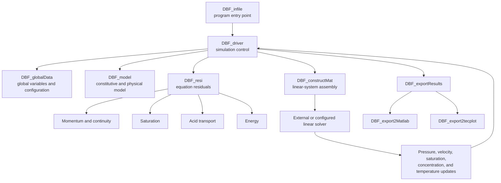
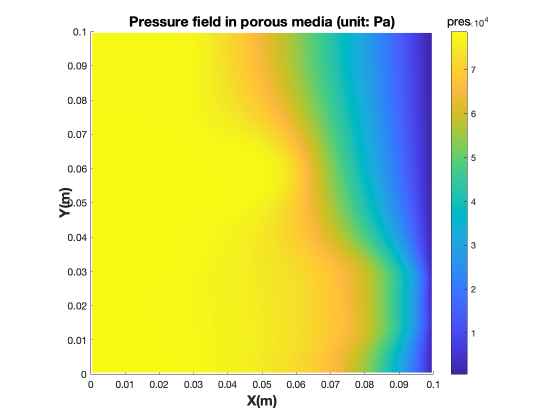
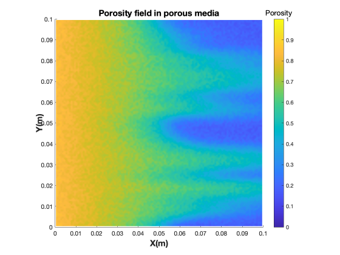
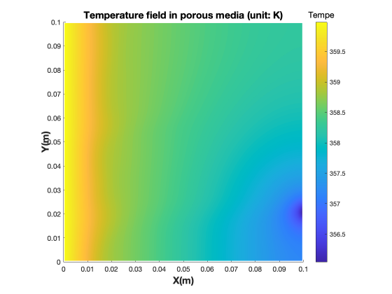
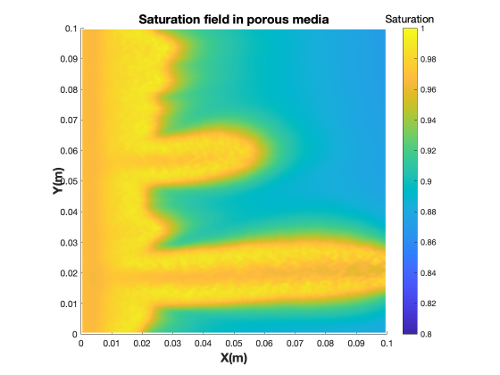

# MatrixAcidization

> A parallel Fortran framework for numerical simulation of reactive transport, wormhole propagation, and single- and two-phase carbonate matrix acidization.

[](https://fortran-lang.org/)
[](#parallel-computing)
[](#version-history)
[](#overview)

---

## Table of Contents

- [Overview](#overview)
- [Highlights](#highlights)
- [Framework Architecture](#framework-architecture)
- [Version History](#version-history)
- [Development Timeline](#development-timeline)
- [Governing Equations](#governing-equations)
- [Numerical Workflow](#numerical-workflow)
- [Solver Architecture](#solver-architecture)
- [Repository Structure](#repository-structure)
- [Core Source Modules](#core-source-modules)
- [Requirements](#requirements)
- [Building the Code](#building-the-code)
- [Running a Simulation](#running-a-simulation)
- [Model Configuration](#model-configuration)
- [Parallel Computing](#parallel-computing)
- [Outputs and Post-processing](#outputs-and-post-processing)
- [Simulation Gallery](#simulation-gallery)
- [Publications](#publications)
- [Citation](#citation)
- [Known Repository Limitations](#known-repository-limitations)
- [Roadmap](#roadmap)
- [Author and Contact](#author-and-contact)
- [License](#license)

---

## Overview

**MatrixAcidization** is a research codebase for simulating the coupled physical and chemical processes that occur during carbonate matrix acidization. The project follows the development of a Darcy–Brinkman–Forchheimer-based simulator from its original single-phase implementation to two-phase and non-isothermal formulations.

The code models interactions among:

- fluid flow in evolving porous media;
- acid transport and dispersion;
- acid–rock reactions;
- mineral dissolution;
- porosity and permeability evolution;
- heat transport in non-isothermal versions;
- water–oil displacement in two-phase versions;
- wormhole initiation, growth, and breakthrough.

The repository contains **five major versions** developed in two generations:

- **V1.0–V3.0:** single-phase matrix-acidization models;
- **V4.0–V5.0:** two-phase water–oil matrix-acidization models.

V3.0 introduces a **decoupled scheme** for the pressure–velocity linear system and reorganizes the code architecture. V5.0 combines two-phase flow with energy conservation.

---

## Highlights

- Five generations of the simulator preserved for reproducibility and comparison.
- Single-phase and two-phase reactive-transport formulations.
- Isothermal and non-isothermal models.
- Darcy, Brinkman, and Forchheimer terms configurable in the source.
- Decoupled pressure–velocity solution strategy in V3.0.
- Two-dimensional and three-dimensional implementations in V1.0–V3.0.
- Two-dimensional implementations in V4.0–V5.0.
- MPI-oriented domain decomposition and parallel execution.
- MATLAB and Tecplot post-processing support.
- Modular Fortran source organized by model, residual, matrix, driver, input, and export responsibilities.

---

## Framework Architecture



The framework couples flow, transport, reaction, thermal effects, and rock-property evolution through a time-dependent nonlinear solution loop.

---

## Version History

| Version | Flow regime | Thermal model | Dimensions | Main contribution |
|---|---|---:|---:|---|
| **V1.0** | Single phase | No | 2D and 3D | Initial parallel matrix-acidization and wormhole-propagation simulator based on mass and momentum conservation. |
| **V2.0** | Single phase | Yes | 2D and 3D | Adds energy conservation to the single-phase framework. |
| **V3.0** | Single phase | Yes | 2D and 3D | Introduces a **decoupled scheme** for solving the pressure–velocity linear system and substantially reorganizes the code structure. |
| **V4.0** | Two phase: water and oil | No | 2D | Extends the simulator to two-phase matrix acidization based on V2.0. |
| **V5.0** | Two phase: water and oil | Yes | 2D | Adds energy conservation to the two-phase formulation for non-isothermal acidizing simulations. |

### Generation I: Single-phase models

#### V1.0

The initial version solves mass and momentum conservation for parallel simulation of wormhole propagation under single-phase conditions.

#### V2.0

V2.0 extends V1.0 by adding an energy-conservation equation, enabling non-isothermal single-phase simulations.

#### V3.0

V3.0 introduces two major changes:

1. a **decoupled scheme** that separates the coupled pressure–velocity problem into systems that can be handled more efficiently by iterative and parallel solvers;
2. a redesigned code framework with clearer responsibilities among the input, model, residual, matrix-construction, driver, and output modules.

### Generation II: Two-phase models

#### V4.0

V4.0 extends the physical model from single-phase flow to two-phase water–oil flow based on V2.0. It includes saturation-dependent flow behavior and phase-specific velocities.

#### V5.0

V5.0 adds energy conservation to the two-phase model and supports non-isothermal coupling among flow, saturation, acid transport, reaction, rock dissolution, and temperature.

---

## Development Timeline



A compact view of the model evolution is:

```text
Single phase                                      Two phase
───────────────────────────────────────────────────────────────────────
V1.0 ─────────► V2.0 ─────────► V3.0 ─────────► V4.0 ─────────► V5.0
Flow             + Energy       Decoupled         Water–oil       + Energy
and reaction                    scheme and        formulation     coupling
                                refactoring
```

---

## Governing Equations

The equations below summarize the physical structure of the framework. Exact coefficients, constitutive laws, variable arrangements, and discretized forms depend on the selected version.

### 1. Mass conservation

A representative mixture or phase mass balance is

```math
\frac{\partial (\phi \rho_{\alpha} S_{\alpha})}{\partial t}
+
\nabla \cdot
(\rho_{\alpha}\mathbf{u}_{\alpha})
=
q_{\alpha}
```

where:

- $\phi$ is porosity;
- $\rho_\alpha$ is the density of phase $\alpha$;
- $S_\alpha$ is phase saturation;
- $\mathbf{u}_\alpha$ is the Darcy or superficial velocity;
- $q_\alpha$ is a source or sink term.

For a single-phase incompressible formulation, this reduces to a continuity constraint coupled to the changing porosity.

### 2. Darcy–Brinkman–Forchheimer momentum conservation

The momentum model combines pressure, viscous diffusion, porous drag, and inertial drag. A representative form is

```math
\frac{\partial}{\partial t}
\left(
\frac{\rho \mathbf{u}}{\phi}
\right)
+
\nabla \cdot
\left(
\frac{\rho \mathbf{u} \otimes \mathbf{u}}{\phi^{2}}
\right)
=
-\nabla p
+
\nabla \cdot \mathbf{\tau}
-
\frac{\mu}{K}\mathbf{u}
-
\beta \rho \lVert \mathbf{u} \rVert \mathbf{u}
+
\rho \mathbf{g}
```

The model terms may be selected conceptually as follows:

| Configuration | Darcy drag | Brinkman term | Forchheimer term |
|---|---:|---:|---:|
| Darcy | Yes | No | No |
| Darcy–Brinkman | Yes | Yes | No |
| Darcy–Forchheimer | Yes | No | Yes |
| Darcy–Brinkman–Forchheimer | Yes | Yes | Yes |

The corresponding source switches are named `isDarcy`, `isBrinkman`, and `isForchheimer`.

### 3. Acid species transport

A representative acid-transport equation is

```math
\frac{\partial (\phi S_w C_f)}{\partial t}
+
\nabla \cdot
(\mathbf{u}_w C_f)
=
\nabla \cdot
\left(
\phi S_w \mathbf{D}_e \nabla C_f
\right)
-
R(C_f,T,a_v)
```

where:

- $C_f$ is the acid concentration in the aqueous phase;
- $\mathbf{D}_e$ is the effective dispersion tensor;
- $R$ is the acid-consumption rate;
- $a_v$ is the reactive surface area per unit bulk volume.

### 4. Acid–rock reaction

The surface reaction is commonly represented by a kinetic law of the form

```math
R_s = k_s(T)\,C_s
```

with mass transfer between the bulk fluid and mineral surface represented by

```math
R_m = k_c \left( C_f - C_s \right)
```

At the reactive surface, the reaction and mass-transfer rates are balanced according to the selected constitutive model.

For temperature-dependent kinetics, an Arrhenius-type relationship may be used:

```math
k_s(T)
=
k_{s,\mathrm{ref}}
\exp\!\left(
-\frac{E_a}{R_g}
\left(
\frac{1}{T}
-
\frac{1}{T_{\mathrm{ref}}}
\right)
\right)
```

### 5. Porosity evolution

Mineral dissolution changes the void volume. A representative porosity update is

```math
\frac{\partial \phi}{\partial t}
=
\frac{\alpha a_v R_s}{\rho_s}
```

where $\alpha$ is a stoichiometric conversion factor and $\rho_s$ is the mineral density.

### 6. Permeability evolution

Permeability evolves with porosity using a constitutive relation. A commonly used form is

```math
\frac{K}{K_0}
=
\left(
\frac{\phi}{\phi_0}
\right)^m
\left(
\frac{1-\phi_0}{1-\phi}
\right)^n
```

where $K_0$ and $\phi_0$ are the initial permeability and porosity.

### 7. Reactive surface-area evolution

The reactive surface area may be related to porosity through a power law:

```math
\frac{a_v}{a_{v,0}}
=
\left(
\frac{\phi}{\phi_0}
\right)^a
\left(
\frac{1-\phi}{1-\phi_0}
\right)^b
```

### 8. Energy conservation

V2.0, V3.0, and V5.0 include energy conservation. A representative local-thermal-equilibrium equation is

```math
\frac{\partial}{\partial t}
\left[
\left(
\phi \rho_f c_{p,f}
+
(1-\phi)\rho_s c_{p,s}
\right)
T
\right]
+
\nabla \cdot
\left(
\rho_f c_{p,f}\mathbf{u}T
\right)
=
\nabla \cdot
\left(
\lambda_{\mathrm{eff}}
\nabla T
\right)
+
Q_{\mathrm{rxn}}
```

### 9. Two-phase saturation transport

V4.0 and V5.0 model water and oil phases with

```math
S_w + S_o = 1
```

A representative water-phase balance is

```math
\frac{\partial (\phi \rho_w S_w)}{\partial t}
+
\nabla \cdot
(\rho_w \mathbf{u}_w)
=
q_w
```

Phase mobility is typically related to relative permeability:

```math
\lambda_{\alpha}
=
\frac{k_{r\alpha}(S_{\alpha})}{\mu_{\alpha}}
```

The current two-phase source exposes water saturation and phase-specific velocities, including quantities such as `Sw`, `vxw`, `vyw`, `vxn`, and `vyn`.

---

## Numerical Workflow



### Conceptual time-step algorithm

```text
1. Read case parameters and initialize fields.
2. Partition the computational domain among MPI processes.
3. For every time step:
   a. update phase and rock properties;
   b. assemble flow residuals and matrices;
   c. solve pressure and velocity;
   d. solve saturation for two-phase versions;
   e. solve acid concentration;
   f. solve temperature when enabled;
   g. compute reaction, dissolution, and porosity change;
   h. update permeability and reactive surface area;
   i. verify convergence and conservation;
   j. export fields and history data.
4. Stop at the prescribed final time or breakthrough condition.
5. Finalize parallel resources.
```

---

## Solver Architecture



### V3.0 decoupled scheme

The original pressure–velocity discretization forms a saddle-point-type linear system:

```math
\begin{bmatrix}
A & G \\
D & 0
\end{bmatrix}
\begin{bmatrix}
\mathbf{u} \\
p
\end{bmatrix}
=
\begin{bmatrix}
\mathbf{f} \\
\mathbf{g}
\end{bmatrix}
```

V3.0 introduces a decoupled strategy that derives separate pressure and velocity systems. Conceptually:

1. derive a pressure equation through elimination or a Schur-complement-type operation;
2. solve the pressure system;
3. recover or solve the velocity components;
4. use iterative and parallel linear solvers for the resulting systems.

This avoids treating the full pressure–velocity block as one monolithic direct-solver problem and improves suitability for large parallel simulations.

---

## Repository Structure

```text
MatrixAcidization/
├── V_1.0/
│   ├── README.txt
│   ├── 2D/
│   └── 3D/
├── V_2.0/
│   ├── README.txt
│   ├── 2D/
│   └── 3D/
├── V_3.0/
│   ├── README.txt
│   ├── 2D/
│   └── 3D/
├── V_4.0/
│   ├── README.txt
│   └── 2D/
├── V_5.0/
│   ├── README.txt
│   └── 2D/
├── docs/
│   └── images/
└── README.md
```

Each version is retained as an independent development milestone. Users should select one version directory rather than combining source files from different versions.

---

## Core Source Modules

The principal source files follow a consistent naming pattern.

| File | Responsibility |
|---|---|
| `DBF_infile.F90` | Main program and case-level setup. |
| `DBF_globalData.F90` | Global variables, arrays, physical parameters, solver switches, and shared state. |
| `DBF_driver.F90` | Initialization, time stepping, property updates, equation sequencing, convergence checks, output, and finalization. |
| `DBF_model.F90` | Physical-property and constitutive-model functions in versions where this module is present. |
| `DBF_resi.F90` | Residual functions for momentum, mass conservation, saturation, concentration, and energy equations. |
| `DBF_constructMat.F90` | Construction of coefficient matrices and coupling blocks. |
| `DBF_exportResults.F90` | Collection and dispatch of simulation output. |
| `DBF_export2Matlab.F90` | MATLAB-compatible output and plotting support. |
| `DBF_export2tecplot.F90` | Tecplot field export. |

In V5.0, matrix-construction routines include components for:

- x- and y-momentum;
- pressure coupling;
- concentration transport;
- water saturation;
- temperature.

The driver includes routines for saturation, pressure–velocity, acid concentration, temperature, porosity, permeability, conservation checks, and breakthrough-related output.

---

## Requirements

The source is written in Fortran and was designed for parallel scientific-computing environments.

Typical requirements are:

- a Fortran compiler supporting the language features used by the selected version;
- an MPI implementation;
- a compatible sparse linear solver selected by the build configuration;
- MATLAB or GNU Octave for generated MATLAB scripts;
- Tecplot for `.plt` output visualization.

Historically referenced environments include Intel Fortran, OpenMPI, KAUST Shaheen, and Neser. Modern builds may require small changes to compiler flags, module names, integer kinds, MPI interfaces, or external-solver bindings.

---

## Building the Code

> **Important:** The current repository snapshot contains the Fortran source but does not include the Makefiles referenced by the version-level notes. A working build therefore requires restoring or creating a Makefile and linking the required MPI and linear-solver libraries.

A minimal MPI-oriented compilation pattern is:

```bash
mpif90 -O3 \
  DBF_globalData.F90 \
  DBF_model.F90 \
  DBF_resi.F90 \
  DBF_constructMat.F90 \
  DBF_export2Matlab.F90 \
  DBF_export2tecplot.F90 \
  DBF_exportResults.F90 \
  DBF_driver.F90 \
  DBF_infile.F90 \
  -o matrix_acidization
```

Not every version contains `DBF_model.F90`. Remove that source from the command when it is absent.

External solver libraries and their include paths must be appended as required. For example:

```bash
mpif90 [compiler flags] *.F90 \
  [solver include flags] \
  [solver library flags] \
  -o matrix_acidization
```

A production Makefile should provide at least:

```make
FC       = mpif90
FFLAGS   = -O3
NP       = 4
TARGET   = matrix_acidization
```

Compiler-specific debugging flags are strongly recommended during porting:

```bash
# GNU Fortran example
-g -O0 -Wall -Wextra -fcheck=all -fbacktrace

# Intel Fortran example
-g -O0 -warn all -check all -traceback
```

---

## Running a Simulation

### 1. Select a version

For example:

```bash
cd V_5.0/2D
```

### 2. Configure the case

Review and edit:

- grid dimensions;
- physical-domain dimensions;
- initial and boundary conditions;
- injection conditions;
- fluid and rock properties;
- acid and reaction parameters;
- time-step and stopping controls;
- MPI process layout;
- Darcy, Brinkman, and Forchheimer switches;
- output directory and output frequency.

The current versions embed many case parameters directly in `DBF_infile.F90` and `DBF_globalData.F90`.

### 3. Create the output directory

Some historical versions expect an existing output directory such as `case` or `case1`:

```bash
mkdir -p case
```

### 4. Compile

```bash
make
```

or use a direct compiler command as described above.

### 5. Run

Serial launch through MPI:

```bash
mpirun -np 1 ./matrix_acidization
```

Parallel launch:

```bash
mpirun -np 4 ./matrix_acidization
```

On a managed cluster, use the site-specific scheduler command, such as `srun`, `aprun`, or the platform's MPI launcher.

### 6. Post-process

Inspect the generated case directory for:

- MATLAB plotting scripts;
- Tecplot `.plt` files;
- history output;
- raw field data;
- pressure-drop or breakthrough data.

---

## Model Configuration

### Darcy–Brinkman–Forchheimer switches

For V4.0 and V5.0, the main flow-model switches are located in `DBF_globalData.F90`:

```fortran
isDarcy       = .true.
isBrinkman    = .true.
isForchheimer = .true.
```

A Darcy-only configuration is:

```fortran
isDarcy       = .true.
isBrinkman    = .false.
isForchheimer = .false.
```

Earlier versions may define the switches in `DBF_resi.F90`.

### Single-phase versus two-phase selection

Single-phase and two-phase formulations are maintained in separate version directories:

```text
V1.0–V3.0  -> single phase
V4.0–V5.0  -> two phase: water and oil
```

They are not intended to be toggled through one runtime flag.

### Thermal selection

Thermal and isothermal formulations are also version based:

```text
V1.0  -> isothermal single phase
V2.0  -> thermal single phase
V3.0  -> thermal single phase with decoupled scheme
V4.0  -> isothermal two phase
V5.0  -> thermal two phase
```

---

## Parallel Computing

The code is designed around domain decomposition and MPI process allocation.

The number of MPI processes must be consistent among:

1. the launcher command;
2. the build configuration;
3. the process-grid allocation used in the Fortran input program.

A process allocation call may appear in a form similar to:

```fortran
call proceAlloc(1, nx, ny, pncols, pnrows)
```

Before running in parallel, verify:

- the total MPI process count;
- the number of process rows and columns;
- divisibility or load balance of the global grid;
- per-process memory requirements;
- compatibility of the selected sparse solver with MPI;
- consistency between the executable and runtime MPI libraries.

Large grids may require distributing the job across more nodes to reduce memory pressure per process.

---

## Outputs and Post-processing

### MATLAB

The code can generate a `matlabplot.m` script and associated data. The MATLAB output is intended primarily for plotting final simulation fields.

Typical use:

```matlab
run("matlabplot.m")
```

### Tecplot

A sequence of `.plt` files can be generated for transient visualization. File-number suffixes correspond to time-step or output indices, allowing the full evolution of the acidizing process to be inspected.

### Representative output variables

Depending on the version, output fields may include:

- pressure;
- x- and y-velocity;
- water- and oil-phase velocities;
- acid concentration;
- porosity;
- permeability;
- reactive surface area;
- water saturation;
- temperature;
- pressure drop;
- acid concentration at the outlet;
- conservation diagnostics;
- breakthrough indicators.

---

## Simulation Gallery

The following paths are reserved for project-generated figures.

<table>
<tr>
<td width="50%">

### Wormhole propagation


Suggested field: porosity or mineral-dissolution pattern at breakthrough.

</td>
<td width="50%">

### Pressure distribution



Suggested field: normalized pressure or pressure drop along the core.

</td>
</tr>
<tr>
<td width="50%">

### Porosity evolution



Suggested field: initial and final porosity or selected time snapshots.

</td>
<td width="50%">

### Temperature field



Suggested source: V2.0, V3.0, or V5.0.

</td>
</tr>
<tr>
<td width="50%">

### Water saturation



Suggested source: V4.0 or V5.0.

</td>
<td width="50%">

### Recommended additional figure

A sixth panel may be added for velocity magnitude, acid concentration, permeability, or breakthrough curves.

</td>
</tr>
</table>

Recommended figure-export conventions:

- use the same spatial aspect ratio across fields;
- include variable names and units;
- use readable color bars;
- state the version and case parameters in each caption;
- avoid using generated placeholders as scientific results;
- prefer PNG or SVG for GitHub display.

---

## Publications

The following publications describe major physical models, numerical methods, and later extensions associated with this research code.

1. **Y. Wu, A. Salama, and S. Sun**,  
   “Parallel simulation of wormhole propagation with the Darcy–Brinkman–Forchheimer framework,”  
   *Computers and Geotechnics*, 69, 564–577, 2015.  
   DOI: [10.1016/j.compgeo.2015.06.021](https://doi.org/10.1016/j.compgeo.2015.06.021)

2. **J. Kou, S. Sun, and Y. Wu**,  
   “Mixed finite element-based fully conservative methods for simulating wormhole propagation,”  
   *Computer Methods in Applied Mechanics and Engineering*, 298, 279–302, 2016.  
   DOI: [10.1016/j.cma.2015.09.015](https://doi.org/10.1016/j.cma.2015.09.015)

3. **J. Kou, S. Sun, and Y. Wu**,  
   “A semi-analytic porosity evolution scheme for simulating wormhole propagation with the Darcy–Brinkman–Forchheimer model,”  
   *Journal of Computational and Applied Mathematics*, 348, 401–420, 2019.  
   DOI: [10.1016/j.cam.2018.08.055](https://doi.org/10.1016/j.cam.2018.08.055)

4. **Y. Wu, J. Kou, S. Sun, and Y.-S. Wu**,  
   “Thermodynamically consistent Darcy–Brinkman–Forchheimer framework in matrix acidization,”  
   *Oil & Gas Science and Technology – Revue d’IFP Energies nouvelles*, 76, Article 8, 2021.  
   DOI: [10.2516/ogst/2020091](https://doi.org/10.2516/ogst/2020091)

5. **Y. Wu, J. Kou, Y.-S. Wu, S. Sun, and Y. Xia**,  
   “A decoupled scheme to solve the mass and momentum conservation equations of the improved Darcy–Brinkman–Forchheimer framework in matrix acidization,”  
   *AIP Advances*, 11, 125305, 2021.  
   DOI: [10.1063/5.0067340](https://doi.org/10.1063/5.0067340)

6. **Y. Wu**,  
   “Two-Phase and Thermal Effects on Dissolution Pattern Evolution during Matrix Acidizing: A Numerical Study,”  
   *Results in Engineering*, 29, 109816, 2026.  
   DOI: [10.1016/j.rineng.2026.109816](https://doi.org/10.1016/j.rineng.2026.109816)

### Relationship between publications and code versions

| Research topic | Most relevant versions |
|---|---|
| Parallel DBF wormhole simulation | V1.0 |
| Non-isothermal single-phase formulation | V2.0 |
| Decoupled pressure–velocity scheme | V3.0 |
| Two-phase matrix acidization | V4.0 |
| Two-phase non-isothermal matrix acidization | V5.0 |

The exact correspondence between a paper and a tagged code snapshot should be verified before citing a particular release as the archived implementation of that publication.

---

## Citation

When using this repository, cite both the software and the publication most closely related to the selected model.

### Software citation

```bibtex
@software{wu_matrixacidization,
  author  = {Wu, Yuanqing},
  title   = {MatrixAcidization: A Parallel Fortran Framework for Reactive Transport and Carbonate Matrix Acidization},
  url     = {https://github.com/wuyuanq/MatrixAcidization},
  note    = {Accessed: YYYY-MM-DD}
}
```

### V3.0 decoupled-scheme citation

```bibtex
@article{wu2021decoupled,
  author  = {Wu, Yuanqing and Kou, Jisheng and Wu, Yu-Shu and Sun, Shuyu and Xia, Yilin},
  title   = {A decoupled scheme to solve the mass and momentum conservation equations of the improved Darcy--Brinkman--Forchheimer framework in matrix acidization},
  journal = {AIP Advances},
  volume  = {11},
  pages   = {125305},
  year    = {2021},
  doi     = {10.1063/5.0071381}
}
```

### DBF framework citation

```bibtex
@article{wu2021thermodynamically,
  author  = {Wu, Yuanqing and Kou, Jisheng and Sun, Shuyu and Wu, Yu-Shu},
  title   = {Thermodynamically consistent Darcy--Brinkman--Forchheimer framework in matrix acidization},
  journal = {Oil \& Gas Science and Technology -- Revue d'IFP Energies nouvelles},
  volume  = {76},
  pages   = {8},
  year    = {2021},
  doi     = {10.2516/ogst/2020091}
}
```

---

## Known Repository Limitations

The current repository should be regarded as a research-code archive rather than a turnkey software package.

Known limitations include:

- the Makefiles referenced by the version notes are not present in the current repository snapshot;
- external sparse-solver dependencies are not bundled;
- input parameters are largely source based rather than read from a documented runtime configuration file;
- no automated regression-test suite is currently included;
- no continuous-integration workflow is currently included;
- authentic simulation figures are not bundled in the current snapshot;
- version-specific compiler and library requirements are not fully documented;
- historical cluster instructions may no longer apply to current systems;
- a formal open-source license file is not currently included.

These limitations should be addressed before describing the repository as immediately reproducible on a new machine.

---

## Roadmap

Recommended improvements include:

- [ ] Add version-specific Makefiles or CMake/fpm build support.
- [ ] Document all external solver dependencies.
- [ ] Add one verified quick-start case for each major model generation.
- [ ] Move case parameters from source files into runtime input files.
- [ ] Add automated conservation and regression tests.
- [ ] Add GitHub Actions for compilation checks.
- [ ] Add representative 2D and 3D datasets.
- [ ] Replace gallery placeholders with authentic simulation results.
- [ ] Add benchmark definitions and expected output.
- [ ] Add solver-performance and parallel-scalability results.
- [ ] Add tagged releases corresponding to publications.
- [ ] Add a `CITATION.cff` file.
- [ ] Add a formal license.
- [ ] Add Doxygen or FORD-generated source documentation.
- [ ] Extend the modern two-phase implementation to 3D.
- [ ] Investigate hybrid MPI/OpenMP and accelerator support.

---

## Author and Contact

**Yuanqing Wu**

- Research areas: reactive transport, porous-media flow, matrix acidization, numerical methods, high-performance computing, and scientific computing
- Email: `wuyuanq@gmail.com`
- GitHub: [wuyuanq](https://github.com/wuyuanq)

Historical affiliations recorded in the version notes include KAUST and Dongguan University of Technology.

For questions about model assumptions, build dependencies, collaboration, or use of the code, contact the author.

---

## License

No explicit license file is included in the current repository snapshot.

Unless a license is added, copyright law generally reserves reuse, modification, and redistribution rights to the copyright holder. Users should contact the author before redistributing the code or using it in commercial work.

A future release should add a standard license such as BSD-3-Clause, MIT, GPL-3.0, or a project-specific academic license after the author determines the intended reuse terms.

---

## Acknowledgment

This repository records the long-term development of numerical methods and parallel implementations for carbonate matrix acidization. Contributions from collaborators and coauthors are reflected in the associated publications.
